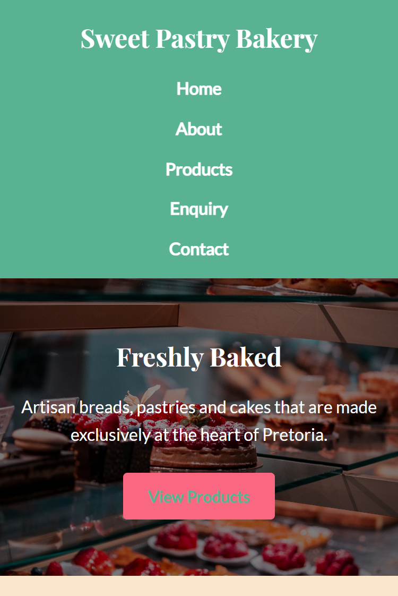

# Sweet Pastry Bakery — Website Project

## Student Information
- Name: Christian Gowera
- Student Number: ST10538439
- Module: WEDE5020 — Web Development (Introduction)
- Year: 2026

## Project Overview
Website that works perfectly well, for Wede5020. Sjould be responsive!

## Website Goals and Objectives
- Increase online enquiries by 40% within just six months
- Show full product catalogue
- Provide contact and location accessibility

## Key Features
- 5 page HTML structure
- Working navigation
- Contact and enquiry forms (Part 3)

## Sitemap
- index. html — Homepage
- about.html — About Us
- products.html — Products
- enquiry.html — Enquiry Form
- contact.html — Contact & Map

## Timeline and Milestones
- Week 1–2: Part 1 (HTML + structure)
- Week 3–4: Part 2 (CSS + responsive)
- Week 5–6: Part 3 (JS + SEO + deployment)

## Changelog
### Part 1
- [2026-05-20] Initial project structure created
- [2026-05-20] All 5 HTML pages created with semantic markup
- [2026-05-20] Navigation links connected across all pages

### Part 1 Feedback Fixes
-  Fixed: added more better images 
-  Fixed: added missing comments to index.html

-  Fixed: deleted unnecessary images

## Part 2 Details

### CSS Stylesheet
- File: css/style.css
- Linked to all 5 HTML pages
- Fonts: Playfair Display (headings) + Lato (body) via Google Fonts

### Responsive Breakpoints
- Desktop: 1200px max-width container
- Tablet: max-width 768px — single column layout, stacked navigation
- Mobile: max-width 480px — reduced font sizes, compact spacing

### Responsive Techniques Used
- CSS custom properties (variables) for consistent theming
- CSS Flexbox for header and navigation layout
- CSS Grid for product cards and page sections
- Relative units (rem, %) throughout — no fixed px font sizes
- max-width: 100% on all images for responsive scaling
- Media queries at 768px and 480px breakpoints

### Screenshots 
- Desktop (1440px): [.png>)]
- Tablet (768px): [.png>)]
- Mobile (375px): []

### Changelog — Part 2
- [2026-27-05] Created style.css
- [2026-27-05] Linked stylesheet and Google Fonts to HTML pages
- [2026-27-05] Added sticky header with flexbox navigation
- [2026-28-05] Added hero section with overlay and call-to-action button
- [2026-28-05] Added product card grid using CSS Grid
- [2026-28-05] Styled forms on enquiry.html and contact.html
- [2026-29-05] Add pseudo-classes (hover, focus, active) to nav and buttons
- [2026-29-05] Added tablet media query 768px
- [2026-29-05] Added mobile media query 480px
- [2026-29-05] Tested on Brave DevTools 
- [2026-27-05] Applied Part 1 feedback 

## References
- Unsplash. 2026. Available at: https://unsplash.com [Accessed: 20 May 2026].
- W3Schools. 2026. Available at: https://www.w3schools.com [Accessed: 20 May 2026].